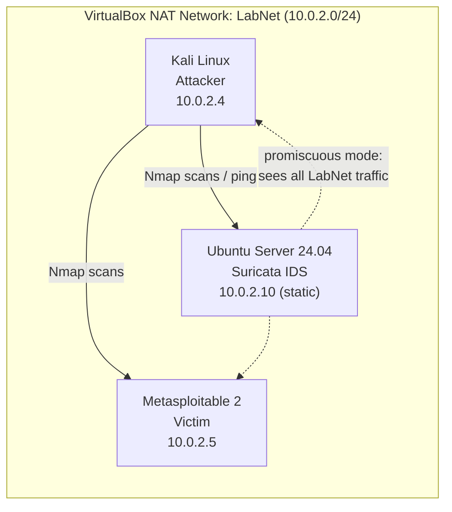

# Suricata IDS Home Lab

A virtual network security lab where I deployed **Suricata** as a network intrusion detection system (IDS), wrote and tuned custom detection rules, and verified them against live reconnaissance traffic from an attacker machine.

   

---

## Skills demonstrated

- Deploying and configuring a network IDS (Suricata) on Linux
- Writing custom Suricata detection rules (ICMP and TCP SYN-scan detection)
- **Rule tuning** to reduce alert fatigue (hundreds of alerts → 1 alert per scan)
- Virtual network design: isolated lab subnet, static IP addressing with Netplan, promiscuous-mode monitoring
- Network troubleshooting: diagnosing an **IP address conflict** using MAC addresses
- Reading and interpreting IDS alert logs (`fast.log`)
- Linux administration: `systemctl`, `nano`, `sed`, `grep`, `tail`, `ip`, `netplan`

---

## Lab architecture



| VM | Role | IP | MAC | RAM |
|---|---|---|---|---|
| Ubuntu Server 24.04 | Suricata 8.0.7 IDS | 10.0.2.10 (static) | 08:00:27:8e:55:7e | 2 GB |
| Kali Linux 2026.2 | Attacker | 10.0.2.4 (DHCP) | 08:00:27:5a:87:bc | 4 GB |
| Metasploitable 2 | Intentionally vulnerable victim | 10.0.2.5 (DHCP) | 08:00:27:5a:02:f5 | 1 GB |

**Host:** Intel MacBook Pro, 16 GB RAM, Oracle VirtualBox.

**Safety:** All VMs sit on an isolated VirtualBox NAT Network. Metasploitable is never bridged or port-forwarded to a real network.

---

## Setup summary

### 1. Install Suricata (Ubuntu VM)

```bash
sudo add-apt-repository ppa:oisf/suricata-stable -y
sudo apt update
sudo apt install suricata -y
sudo suricata-update          # downloads the Emerging Threats Open ruleset
```

`suricata-update` loaded **52,990 enabled rules** from the ET Open ruleset.


### 2. Configure Suricata

Changes to `/etc/suricata/suricata.yaml` (details in [`configs/suricata-yaml-changes.md`](configs/suricata-yaml-changes.md)):

- Set the capture interface from the default `eth0` to the VM's real interface, `enp0s3`
- Added my custom rules file to `rule-files`
- `HOME_NET` left at the default private ranges (covers the 10.0.2.0/24 lab subnet)

Validate before every restart:

```bash
sudo suricata -T -c /etc/suricata/suricata.yaml -v
sudo systemctl restart suricata
```

### 3. Lab network

- Created a VirtualBox **NAT Network** called `LabNet` (10.0.2.0/24)
- Set the Ubuntu IDS adapter to **Promiscuous Mode: Allow All**, so Suricata sees traffic between *other* VMs, not just traffic addressed to itself
- Gave the IDS a **static IP** (10.0.2.10) with Netplan; see [`configs/netplan-99-lab.yaml`](configs/netplan-99-lab.yaml)

---

## Custom detection rules

Full file: [`rules/local.rules`](rules/local.rules)

```
alert icmp any any -> any any (msg:"LAB - ICMP Ping Detected"; itype:8; sid:1000001; rev:1;)
alert tcp any any -> $HOME_NET any (msg:"LAB - Nmap Stealth Scan Detected"; flags:S; threshold: type both, track by_src, count 5, seconds 10; sid:1000002; rev:2;)
```

| Rule | What it detects | How |
|---|---|---|
| `sid:1000001` | Ping (ICMP echo request) | `itype:8` = echo request |
| `sid:1000002` | TCP SYN port scan (e.g. `nmap -sS`) | 5+ SYN packets from one source within 10 seconds |

The first version of the rules file (before tuning the scan rule to rev 2):


---

## Tests and results

### Test 1: Custom rule fires on live traffic

Pinged an external host from the IDS and confirmed the custom ICMP rule alerted.


### Test 2: Detecting a SYN scan from Kali

```bash
sudo nmap -sS 10.0.2.10      # from Kali
```

Suricata logged the scan, attributing it to Kali (10.0.2.4). The Kali output below shows both scans: the first hit the wrong device (see Troubleshooting #3), and the second hit the IDS itself, confirmed by its MAC address `08:00:27:8E:55:7E`.


### Test 3: Rule tuning to reduce alert fatigue

The first version of the scan rule used `threshold: type threshold`, which fires **every** time the count is reached. One scan of 1,000 ports produced **hundreds of duplicate alerts**:


I changed it to `type both` (alert once when the threshold is reached, then suppress for the rest of the time window) and bumped the revision to `rev:2`. The same scan now produces **one alert**:


The `[1:1000002:2]` in the alert confirms Suricata is running revision 2 of the rule.

**Why it matters:** in a SOC, duplicate alerts bury the events analysts actually need to see. One high-quality alert per attacker per time window is easier to triage.

### Test 4: Network-wide monitoring (IDS detects an attack on *another* machine)

Kali scanned Metasploitable (10.0.2.4 → 10.0.2.5). The IDS at 10.0.2.10 was not involved in the traffic, but still detected it thanks to promiscuous mode, which is how a real network IDS or SPAN-port sensor works.


The scan also showed Metasploitable's large **attack surface**: about 23 open services, including FTP, Telnet, SSH, HTTP, MySQL, PostgreSQL and VNC. On a production server, most of these would be closed or firewalled.

### Bonus: Emerging Threats rule caught the attacker OS

Without any custom rule, ET rule `2022973` flagged **"Possible Kali Linux hostname in DHCP Request Packet"** from 10.0.2.4, identifying a penetration-testing OS joining the network. It repeats on every DHCP lease renewal (~5 min), which makes it a good candidate for suppression once the source is known and approved.

---

## Troubleshooting log

Real problems I hit and how I solved them:

### 1. Suricata failed to start

`systemctl status suricata` showed `failed` with "start request repeated too quickly." The default config listens on `eth0`, but the VM's interface is `enp0s3`.

**Fix:** `sudo sed -i 's/interface: eth0/interface: enp0s3/' /etc/suricata/suricata.yaml`, then validated with `suricata -T` and restarted.

### 2. Test site unreachable

The common Suricata test site (testmynids.org) did not resolve. I confirmed the VM's internet and DNS worked (`ping 8.8.8.8`, `ping google.com`), so the site itself was the issue.

**Fix:** wrote my own ICMP rule and used it as the detection test instead.

### 3. IP address conflict, found by checking the MAC address

After moving the IDS onto LabNet, DHCP gave it **10.0.2.3**. An Nmap scan of that address returned:

```
53/tcp open  domain
MAC Address: 52:54:00:12:35:00 (QEMU virtual NIC)
```

The IDS's real MAC is `08:00:27:8e:55:7e`, and it runs no DNS server. The scan had hit **VirtualBox's built-in NAT Network service**, which also answers on 10.0.2.3. Two devices were sharing one IP.


**Fix:** assigned the IDS a static IP outside the conflict (10.0.2.10) with Netplan, then re-scanned and confirmed the MAC matched the Ubuntu VM.


**Lesson:** an IP address tells you where traffic *goes*; the MAC address tells you *what answered*. Checking it caught a problem that alerts alone would have hidden.

### 4. Metasploitable "failed to boot"

The VirtualBox wizard didn't attach the existing `Metasploitable.vmdk` disk. **Fix:** attached it manually under **Settings, then Storage**.

---

## What I learned

- How a signature-based IDS inspects traffic and how rule options (`flags`, `itype`, `threshold`, `sid`, `rev`) work
- Why detection engineering includes **tuning**, not just writing rules
- How promiscuous mode lets one sensor monitor a whole network segment
- Validating configs (`suricata -T`) before restarting a production service
- Using MAC addresses and service fingerprints to verify *which* host answered

## Next steps

- [ ] Suppress the known-benign Kali DHCP alert with a `threshold.config` suppress entry
- [ ] Add web-application detection rules and test them against DVWA on Metasploitable
- [ ] Ship `eve.json` logs to a SIEM (Wazuh or the Elastic Stack) for dashboards
- [ ] Try Suricata in IPS (inline blocking) mode

---

## Repository layout

```
suricata-ids-homelab/
├── README.md
├── rules/
│   └── local.rules              # custom detection rules
├── configs/
│   ├── netplan-99-lab.yaml      # static IP for the IDS
│   └── suricata-yaml-changes.md # changes made to suricata.yaml
└── screenshots/                 # evidence for each test
```

## Credits

Lab idea adapted from [0xrajneesh/Suricata-IDS-Home-Lab](https://github.com/0xrajneesh/Suricata-IDS-Home-Lab), updated for Suricata 8, Ubuntu 24.04 and VirtualBox NAT Networks.

> **Disclaimer:** All testing was done in an isolated lab on machines I own. Only scan systems you have explicit permission to test.
